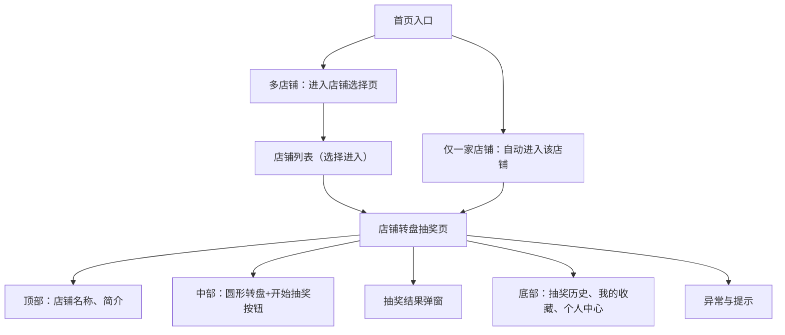

# 项目结构与技术要点总结

## 目录结构

```
小程序/
  ├── cloudfunctions/           # 云函数目录
  │   └── quickstartFunctions/  # 示例云函数
  ├── miniprogram/              # 小程序主目录
  │   ├── app.js                # 全局 JS 逻辑
  │   ├── app.json              # 全局配置
  │   ├── app.wxss              # 全局样式
  │   ├── envList.js            # 环境变量配置
  │   ├── sitemap.json          # 小程序爬虫配置
  │   ├── components/           # 自定义组件
  │   ├── images/               # 图片资源
  │   └── pages/                # 页面目录
  │       ├── index/            # 首页
  │       └── example/          # 示例页
  ├── project.config.json       # 项目配置
  ├── project.private.config.json # 私有配置
  ├── README.md                 # 项目说明
  └── uploadCloudFunction.sh    # 云函数上传脚本
```

## 技术要点

- **微信小程序框架**：基于微信官方小程序开发框架，使用 WXML（模板）、WXSS（样式）、JS（逻辑）、JSON（配置）四大文件类型。
- **页面结构**：每个页面由四个文件组成：.js（逻辑）、.json（页面配置）、.wxml（结构）、.wxss（样式）。
- **组件化开发**：支持自定义组件，便于代码复用和模块化。
- **云开发能力**：内置 cloudfunctions 目录，支持云函数（可选用，适合需要后端能力的场景）。
- **资源管理**：images 目录用于存放图片等静态资源。
- **配置文件**：app.json 管理全局页面路由和窗口表现，project.config.json 管理开发工具相关配置。

## 首页（客户端转盘抽奖）设计要点

### 1. 店铺入口
- 客户通过首页店铺列表进入店铺，可设置默认店铺。
- 店铺首页可展示店铺介绍，介绍有默认值，商家可修改。

### 2. 美食数据来源
- 客户抽取的美食数据仅来自当前店铺由商家编辑的美食列表。
- 美食信息包括：名称（必填）、图片（非必填）、介绍（非必填）。
- 图片和介绍有默认值，支持从网络搜索美食名称自动补全。

### 3. 转盘设计
- 采用传统圆形转盘样式。
- 转盘分区数量随美食数量动态变化。
- 转盘上展示美食名称、图片，必要时可展示简要介绍。

### 4. 抽奖交互
- 客户通过点击按钮触发转盘抽奖。
- 有轮盘动画效果，动画时长和细节后续可优化。
- 抽奖结果以弹窗形式展示对应美食图片，并显示"恭喜"提示。

### 5. 抽奖结果
- 抽奖结果需展示美食名称、图片和介绍。
- 支持"再来一次"功能，无次数限制。
- 暂不支持分享结果。

### 6. 用户体验
- 没有美食时需有友好提示。
- 需处理网络异常或数据加载失败的情况。
- 暂不要求登录，后续可增加登录和抽奖次数限制。

### 7. 其他功能
- 需有抽奖历史记录功能。
- 支持客户收藏喜欢的美食。

---

> 以上为首页（客户端转盘抽奖）功能与体验设计要点，后续如有调整可随时补充。

## 商家端设计要点

### 1. 店铺管理
- 商家可直接创建店铺，且同一账号下仅能拥有一个店铺。
- 店铺信息包括：店铺名称、封面、简介。

### 2. 美食管理
- 支持添加、编辑、删除美食。
- 美食信息包括：名称、图片、介绍、价格、标签。
- 支持批量导入美食和一键生成默认美食。

### 3. 美食图片与介绍
- 支持自动搜索和补全美食图片与介绍。
- 支持上传本地图片。

### 4. 数据保存与同步
- 商家编辑的信息需保存后，实时同步到客户端抽奖端；未保存则不同步。
- 支持草稿功能。

### 5. 店铺预览与分享
- 商家可预览自己的店铺和美食转盘效果。
- 支持一键分享店铺给客户。

### 6. 权限与身份
- 商家通过微信授权登录。
- 支持多商家协作管理同一店铺。

### 7. 用户体验
- 操作流程简洁，无需额外引导或帮助说明。
- 需给予明确的错误提示和操作反馈。

### 8. 其他功能
- 需有用户收藏数据统计。
- 暂不支持店铺公告、活动推送等扩展功能。

### 概率设置隐藏入口（平台方专用）

为防止普通商家随意修改中奖概率，概率设置功能仅对平台方开放，采用"隐藏入口+密码解锁"方案：

1. 在商家端页面（如shopadmin或foodedit）某个不显眼区域（如页面标题、LOGO、空白处）监听点击事件。
2. 连续点击10次后，弹出密码输入框。
3. 密码正确后，显示概率编辑UI或跳转概率设置页。
4. 概率设置功能仅解锁后可见，普通商家无法访问。
5. 点击计数有超时（如2秒内未点满自动重置），密码可前端写死或后台校验。

后续做完商家端功能后，再实现此隐藏入口和概率设置功能。

---

> 以上为商家端功能与体验设计要点，后续如有调整可随时补充。

后续如有新需求或功能扩展，可在此文件补充设计与技术说明。

## 客户端首页（转盘抽奖页）页面原型设计

### 用户流程
1. 多店铺时：进入首页，先看到"店铺选择页"，用户选择一个店铺后进入该店铺的转盘抽奖页。
2. 仅有一家店铺时：用户打开首页自动进入该唯一店铺的转盘抽奖页，无需选择。

### 页面结构树（文字版）

- 首页入口
  - 多店铺：进入店铺选择页
    - 店铺列表（选择进入）
      - 店铺转盘抽奖页
  - 仅一家店铺：自动进入该店铺
    - 店铺转盘抽奖页
      - 顶部：店铺名称、简介
      - 中部：圆形转盘（美食名称+图片）、开始抽奖按钮
      - 抽奖结果弹窗：美食图片、名称、介绍、再来一次、收藏
      - 底部：抽奖历史、我的收藏、个人中心（Tab栏）
      - 异常与提示：暂无美食、网络异常等

### 页面结构草图（Mermaid）



---

> 以上为客户端首页（转盘抽奖页）页面原型设计，后续如有调整可随时补充。

## 商家端首页（店铺管理页）页面原型设计

### 页面结构树（详细版）

- 商家端首页（店铺管理页）
  - 顶部区域
    - 店铺名称（可编辑输入框）
    - 店铺封面（图片展示+上传/更换按钮）
    - 店铺简介（可编辑多行输入框）
    - 店铺预览按钮
    - 店铺分享按钮
  - 美食管理区
    - 美食列表
      - 每个美食项
        - 美食图片（可编辑/上传）
          - 根据图片自动匹配美食名称
          - 根据图片自动补全美食介绍
        - 美食名称（可编辑）
          - 根据名称自动匹配图片
          - 根据名称自动补全美食介绍
        - 美食介绍（可编辑）
        - 价格（可编辑）
        - 标签（可编辑/多选）
        - 编辑按钮
        - 删除按钮
    - 添加美食按钮
    - 批量导入按钮
    - 一键生成默认美食按钮
  - 保存与草稿
    - 保存按钮（高亮显示，未保存时可见）
    - 草稿提示（如"有未保存内容"）
  - 协作与权限（可选，后续可扩展）
    - 协作商家列表（头像+昵称）
    - 邀请协作按钮
  - 底部区域
    - 数据统计入口（如"用户收藏数"按钮/展示）
    - 返回按钮
    - 退出登录按钮
  - 异常与提示
    - 操作成功提示（如"保存成功"弹窗）
    - 操作失败提示（如"保存失败，请重试"）
    - 网络异常提示
    - 数据加载失败提示

---

> 以上为商家端首页（店铺管理页）页面原型设计，特别强调美食项下的智能补全功能：根据名称自动补全图片和介绍。后续如有调整可随时补充。 

## 美食编辑页（弹窗或独立页）页面原型设计

### 结构树（优化版）

- 美食编辑页（弹窗或独立页）
  - 信息编辑区
    - 美食名称输入框（最上方）
    - 美食图片展示区
      - 当前图片
      - 上传/更换图片按钮
    - 美食介绍输入框（多行）
    - 价格输入框
    - 标签选择（多选/自定义标签）
  - 智能补全按钮（单独一行，点击后可根据当前已填信息智能补全图片和介绍）
  - 操作区（页面最下方）
    - 取消按钮
    - 保存按钮
    - 删除按钮（仅编辑已有美食时显示）
  - 异常与提示
    - 校验提示（如必填项为空）
    - 操作成功/失败提示
    - 网络异常提示

### 交互说明
- 用户优先填写美食名称，再上传图片，最后填写介绍、价格、标签。
- 智能补全为独立按钮，点击后可根据已填信息自动推荐图片和介绍，用户可选择是否采用。
- 操作按钮（取消、保存、删除）始终固定在页面底部，便于操作。

---

> 以上为美食编辑页页面原型设计，后续如有调整可随时补充。 